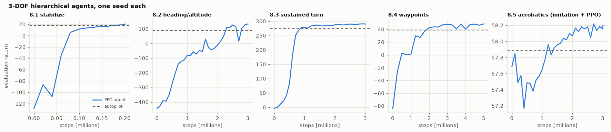
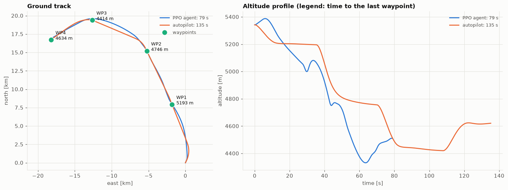
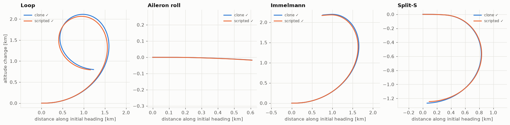

# jetfighter-rl

[](https://github.com/elouansalaun/jetfighter-rl/actions/workflows/tests.yml)


**Teaching a simulated F-16 to fly with reinforcement learning:** a Gymnasium environment
and a curriculum of PPO agents that learn to recover from unusual attitudes, reach a heading
and altitude, fly a maximum sustained turn, navigate 3D waypoints and perform aerobatics.
First through the fly-by-wire, then by moving the control surfaces directly at 50 Hz.

> The aircraft comes from **[jetfighter-sim](https://github.com/elouansalaun/jetfighter-sim)**
> (the `jetsim` package): 3-DOF and 6-DOF flight dynamics on NASA wind-tunnel data,
> instruments, fly-by-wire and autopilot, validated by 596 tests. This repository installs it
> as a dependency and adds everything needed to learn on it.



## Results

Every task has a **reference policy**: the classical autopilot from `jetsim` (or a scripted
pilot for aerobatics). Agents are judged by their episode return relative to that reference,
and by a strict per-task success criterion. Best evaluated model of each experiment, one seed
(`results/runs/`):

| Task | Hierarchical, 3-DOF | Hierarchical, 6-DOF | Direct surfaces, 6-DOF (8.6) |
|---|---|---|---|
| 8.1 Recover from an unusual attitude | **117 %** · 100 % success | **116 %** · 100 % | 99 % · 100 % |
| 8.2 Reach heading / altitude / speed | **142 %** · 90 % | **135 %** · 90 % | 98 % · 100 % |
| 8.3 Maximum sustained turn | **106 %** · 100 % | **161 %** · 100 % | **136 %** · 100 % |
| 8.4 Fly through 3D waypoints | **124 %** · 100 % | **118 %** · 100 % | 98 % · 90 % |
| 8.5 Aerobatics: loop, roll, Immelmann, Split-S | 101 % · 100 % (imitation + PPO) | — ¹ | 100 % · 100 % |

*Percentages: agent return ÷ reference return on the same evaluation episodes; then the agent's
success rate. The references succeed 100 % of the time, except on 8.4 (90 %).*
¹ *Trained before a reward hack on 8.5 was fixed, not retrained since.*

Things the table does not show, which notebook 8 discusses in detail:

- **A higher return is not always a better flight.** On 8.2 the agent outscores the autopilot
  but fails the strict "no overshoot" criterion more often.
- **Five reward hacks**, none visible on the reward curves, all found by replaying
  trajectories. For example, on the sustained turn the agent turned 2.5× faster than the
  "optimum" in a descending spiral, losing 3 km; on aerobatics it learned that *not doing the
  figure* was the safest option.
- **Pure RL never discovered the loop, Immelmann or Split-S.** The aerobatics agents start
  from behavior cloning of a scripted pilot (DART noise injection, critic warm-up), then PPO
  fine-tunes them.
- **Direct surface control is harder.** Without the fly-by-wire, agents reach 90–100 %
  success and 72–84 % of the hierarchical 6-DOF return on 8.1–8.4; PPO clearly improves on
  the imitated reference only for the sustained turn (+36 %) and can slowly *degrade* a
  cloned policy (8.2).

| Waypoints: agent vs autopilot | Aerobatics: cloned policy vs scripted pilot |
|---|---|
|  |  |

On the waypoint course the agent cuts corners, since it also observes the next waypoint, and
finishes in ~79 s where the autopilot needs ~143 s.

## How it works

```
                  ┌──────────────────────────────────────────────────┐
                  │  RL agent (PPO, SAC, imitation)   phase 8        │
jetfighter-rl     │  Gymnasium env: tasks, rewards    phase 7        │  ◄ this repo
                  └─────────┬────────────────────────────▲───────────┘
                    command │                            │ observation,
                            │                            │ reward, done
                  ┌─────────▼────────────────────────────┴───────────┐
                  │  control/   fly-by-wire, autopilot  phase 6      │
jetsim            │  aircraft/  3-DOF & 6-DOF dynamics  phases 2-3   │
                  │             instruments, sensors,                │
                  │             flight envelope         phase 4      │
                  │  core/      frames, ISA, RK4        phase 1      │
                  │  viz/       recording, Tacview      phase 5      │
                  └──────────────────────────────────────────────────┘
```

- **Two action modes.** *Hierarchical*: the agent commands load factor, roll rate and
  throttle, and the fly-by-wire moves the surfaces (a zero action holds the current flight
  path). *Low level*: the agent moves elevator, ailerons, rudder and throttle directly at 50 Hz,
  with nothing to protect it from stalling or overstressing the airframe.
- **Observations from measured instruments** (optionally noisy), with the attitude encoded as
  the **direction of gravity in body and wind axes**. Euler angles flip by 180° at the
  vertical, and a looping agent "thought it was inverted" and stopped.
- **Rewards designed against loopholes.** Each task defines shaped terms plus a success
  criterion; a crash costs a fixed penalty *plus the worst cost of all remaining steps*,
  otherwise crashing was cheaper than flying on when far from the target.
- **Curriculum and transfer.** Each 3-DOF policy is copied into a 6-DOF agent
  (matching weights copied, new inputs zero-initialized) and fine-tuned.
- **Reproducible experiments.** One YAML file per experiment, several seeds, per-term reward
  logging in TensorBoard, periodic evaluation against the reference, and the best model kept.

## Quickstart

```bash
git clone https://github.com/elouansalaun/jetfighter-rl.git && cd jetfighter-rl
uv venv && uv pip install -e ".[dev,rl]"   # pulls jetsim from GitHub, plus PyTorch and SB3
uv run pytest
```

Use the environment:

```python
import gymnasium as gym

import jetfighter_rl.envs  # noqa: F401  (registers the JetFighter/* environments)

env = gym.make("JetFighter/HeadingAltitude-v0", model="6dof")  # or action_mode="low_level"
obs, info = env.reset(seed=0)
obs, reward, terminated, truncated, info = env.step(env.action_space.sample())
```

Evaluate a trained agent shipped in `results/runs/`:

```python
from jetfighter_rl.envs.baselines import evaluate
from jetfighter_rl.envs.jet_env import JetEnv
from jetfighter_rl.training import load_model
from jetfighter_rl.training.callbacks import AgentPolicy
from jetfighter_rl.training.evaluate import env_config_for

path = "results/runs/8_4_waypoints/20260928_143754/seed0/best_model.zip"
env = JetEnv(env_config_for(path))  # same task / model / action mode as in training
result = evaluate(env, AgentPolicy(load_model(path)), episodes=5, seed=0)
print(f"return {result.mean_return:.1f}, success {result.success_rate:.0%}")
```

Or from the command line, with a side-by-side Tacview flight (agent in blue, autopilot in
orange) and comparison plots:

```bash
python scripts/evaluate_agent.py results/runs/8_4_waypoints/20260928_143754/seed0/best_model.zip
```

## Training

```bash
# one experiment (seeds, steps, hyperparameters: see configs/training/*.yaml)
python scripts/train.py configs/training/8_1_level.yaml --seeds 0

# transfer a 3-DOF policy to the 6-DOF model
python scripts/train.py configs/training/8_1_level.yaml --model 6dof --init-from 8_1_level

# the whole hierarchical program 8.1 -> 8.5, 3-DOF then 6-DOF (several hours)
python scripts/run_curriculum.py configs/training/curriculum.yaml --dry-run
python scripts/run_curriculum.py configs/training/curriculum.yaml --seeds 0

# step 8.6: direct surface control (6-DOF, 50 Hz), imitation then PPO
python scripts/run_curriculum.py configs/training/curriculum_low_level.yaml --seeds 0

# follow the training: every reward term, task metrics, reference level
tensorboard --logdir runs
```

| Task (`task:` in the YAML) | Step | What the agent must do |
|---|---|---|
| `level` | 8.1 | recover from an unusual attitude and hold level flight |
| `heading_altitude` | 8.2 | reach a commanded heading, altitude and speed without overshoot |
| `sustained_turn` | 8.3 | turn as fast as possible without losing altitude or energy |
| `waypoints` | 8.4 | fly through a sequence of 3D waypoints |
| `aerobatics` | 8.5 | loop, aileron roll, Immelmann, Split-S (`task_kwargs: {maneuvers: [loop]}` for one) |

The `*_imitation.yaml` variants start from behavior cloning of the reference, `*_sac.yaml`
uses SAC instead of PPO, and `8_6_*.yaml` are the direct-surface versions. New runs go to
`runs/` (not versioned). Each run on a laptop CPU took 2–40 minutes (8 parallel environments).

## Results folder

```
results/
├── runs/<experiment>/<date_time>/   every recorded run: config.yaml, summary.json,
│                                    seed0/evaluations.csv, and best_model.zip for the
│                                    best run of each experiment (16 trained agents)
├── flights/                         agent vs reference flights: Tacview .acmi + plots
└── figures/                         figures exported from the notebooks
```

The flights in `results/flights/` were produced by `scripts/evaluate_agent.py`. On those
independent evaluations, the waypoint agent (3-DOF) and the direct-surface sustained-turn
agent reached 100 % success over 10 episodes, and the direct-surface aerobatics agent 95 %
over 20 episodes (one crash), slightly below its 100 % during training evaluation.

## Notebooks

| # | Notebook | Content |
|---|---|---|
| 0 | [Project overview](notebooks/00_project_overview.ipynb) | Goal, architecture, design decisions, results at a glance |
| 7 | [Gymnasium environment](notebooks/07_gym_environment.ipynb) | Actions, observations, rewards, crash penalty, reference policies |
| 8 | [RL maneuvers](notebooks/08_rl_maneuvers.ipynb) | PPO, live training, curriculum, reward hacking, imitation, transfer, direct surface control |

Notebooks 1–6 (physics, aircraft models, instruments, visualization, classical control) are in
[jetfighter-sim](https://github.com/elouansalaun/jetfighter-sim/tree/main/notebooks).

## Repository layout

```
src/jetfighter_rl/
├── envs/        JetEnv (Gymnasium), tasks, rewards, reference policies   (phase 7)
│   └── tasks/   level, heading/altitude, sustained turn, waypoints, aerobatics
└── training/    YAML configs, PPO/SAC training, callbacks, curriculum,
                 behavior cloning, 3-DOF -> 6-DOF transfer, evaluation    (phase 8)
configs/training/   one YAML per experiment + curriculum files
scripts/            train, run_curriculum, evaluate_agent, phase7_env_check
tests/              environment, task and training tests
notebooks/          guided tour, phases 0, 7 and 8
results/            recorded runs, trained agents, flights, figures
project_roadmap.md  detailed roadmap and decision log (in French)
```

## Working on both repositories

`jetsim` is a git dependency pinned to a release tag (see `pyproject.toml`). To develop both
side by side, install the simulator in editable mode on top:

```bash
git clone https://github.com/elouansalaun/jetfighter-sim.git ../jetfighter-sim
uv pip install -e ".[dev,rl]" && uv pip install -e ../jetfighter-sim
```


## License

[MIT](LICENSE) © Elouan Salaun
